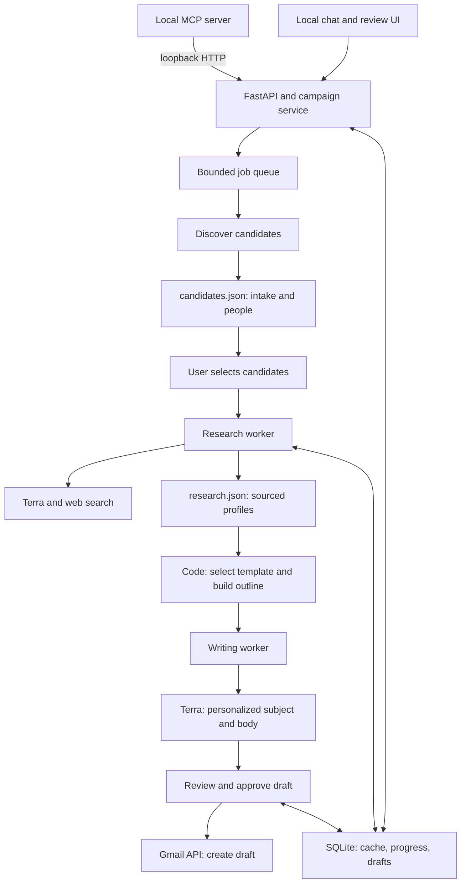
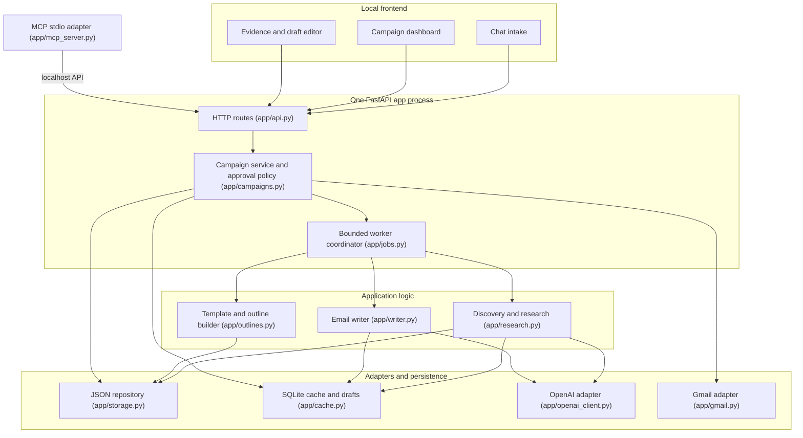

# HERMES

**HERMES — Human-reviewed Email Research, Messaging, and Engagement System** — is Nitu's personal command center
for research, outreach, and eventually much broader email automation. It finds professors, startup people, speakers,
and mentors; researches them from public sources; drafts genuinely personalized messages; and puts approved messages
into Gmail **Drafts**. The current MVP never sends mail.

## Why HERMES?

In Greek mythology, Hermes is the messenger who moves quickly between worlds. This project borrows that idea for a
modern workflow: carry an intent from a rough request, through discovery and evidence, into a clear message ready for
the right person's inbox. HERMES is meant to become more than a one-off email generator. The long-term vision is a
large personal email-automation system that can manage research, contacts, campaigns, follow-ups, and outcomes while
keeping consequential actions visible and under human control.

The design principle is **high-volume capability without low-quality outreach**. HERMES automates repetitive research,
organization, personalization, and drafting, but requires review before an email enters Gmail.

One Python process (FastAPI + asyncio workers + SQLite), plain HTML/CSS/JS UI, optional stdio MCP adapter. Local
single-user mode is the default and needs no account setup. An optional remote mode adds logins and per-user data
isolation behind HTTPS (see [docs/remote-deployment.md](docs/remote-deployment.md)).

## Run

```bash
python3.13 -m venv .venv
.venv/bin/pip install --require-hashes --no-deps -r requirements-dev.lock   # pinned, hash-checked
.venv/bin/python -m playwright install chromium   # only needed for the browser test
cp .env.example .env            # leave OPENAI_API_KEY empty for demo mode
.venv/bin/python -m app.api     # validates config, prints http://127.0.0.1:8765/?t=<token>; open that exact link
.venv/bin/python -m pytest -q   # full suite (unit, workflow, remote isolation, load, browser)
```

Operating the app (checks, logs, health endpoints, migrations and rollback, encrypted backup and restore, deletion
and retention, shutdown behavior) is covered in [docs/operations.md](docs/operations.md).

**Demo mode** (no `OPENAI_API_KEY`): discovery/research/writing use fictional fixture people labeled "(demo)", with
pages served locally at `/demo/pages/...` so source links open. One person per list has an unreachable page and one
has no public email, to show failure isolation and the missing-email state. The header badge says DEMO DATA.

**Live mode**: set `OPENAI_API_KEY` (and optionally `OPENAI_MODEL`, default `gpt-5.6-terra`). Discovery and research
use the Responses API with the `web_search` tool plus structured outputs; pages are fetched directly with a size cap.

## Connect Gmail (optional)

1. Google Cloud console: create a project, enable the **Gmail API**.
2. OAuth consent screen: External, add yourself as a test user. Scope: `https://www.googleapis.com/auth/gmail.compose` only.
3. Credentials: create an **OAuth client ID** of type **Desktop app**, download the JSON to
   `~/.config/outreach/credentials.json` (outside the repo; path configurable via `GMAIL_CREDENTIALS`).
4. `.venv/bin/python -m app.gmail` once; a browser window completes consent and saves `~/.config/outreach/token.json` (0600).
5. Restart the app. Without Gmail, approved drafts can still be previewed and exported as text.

`gmail.compose` creates/reads drafts; no inbox read scope is requested. Each Gmail draft carries an `X-Outreach-Key`
header; if a create call times out, the retry first scans recent drafts for that key instead of creating a duplicate.

## MCP

With the app running, register the stdio adapter, e.g. in Claude Code:

```bash
claude mcp add hermes -- /path/to/.venv/bin/python -m app.mcp_server
```

Tools: `create_campaign`, `find_candidates`, `research_candidates`, `generate_drafts`, `list_campaign`,
`create_gmail_drafts`. The adapter only calls the loopback API (token from `~/.config/outreach/app_token`), so the
same approval rules apply: Gmail drafts are only created for drafts a human approved in the UI.

## Where data lives

- `candidates.json`, `research.json` at the repo root are **unfilled templates**; never modified.
- Each campaign gets `data/<campaign_id>/candidates.json` (intake + lightweight candidates) and
  `data/<campaign_id>/research.json` (sourced profiles keyed by `candidate_id`). `campaign_id` is generated and
  validated; paths always resolve under `data/`.
- `data/cache.sqlite3`: page cache (7 days, failures 1 hour), research cache (14 days), drafts keyed by
  `(campaign_id, candidate_id, template_version)`, jobs, usage counters, activity log. Not a substitute for the JSON files.
- Secrets: `.env` (git-ignored) and `~/.config/outreach/`. Nothing secret goes in campaign files or the browser.
- Remote mode: `data/auth.sqlite3` (accounts, hashed sessions, encrypted provider credentials) and one full data root
  per user under `data/users/<id>/`.
- Backups: `python -m app.ops backup FILE` writes an encrypted snapshot of the whole data root;
  `python -m app.ops restore FILE` puts it back (see docs/operations.md).

JSON updates are a bounded read-modify-write under a per-campaign lock, written to a temp file, fsynced, then
`os.replace`d. That is O(n) I/O and memory per write. The load test covers 3 concurrent campaigns of 100 people
each. SQLite and JSON schema changes go through explicit migrations that back up the file first
(`app/migrations.py`).

## Pipeline

intake → discovery → candidate review → research → evidence review → outline → draft → human review → Gmail Drafts.

- **Intake**: request text is parsed deterministically into editable fields; nothing is searched until you confirm.
- **Research**: every evidence claim must point at a URL the model cited or the app fetched; others are dropped.
  An email is `email_verified_on_page` only if the literal address appears on the fetched contact page. Missing emails
  are shown as missing, never guessed.
- **Outline**: plain code picks `research_professor`, `startup`, `speaker_invite`, or `rsvp_followup` from the intake
  (see `app/outlines.py` to edit). An RSVP follow-up is blocked unless you marked the invitation as sent.
- **Draft**: the writer gets only the outline, selected facts, recipient, and tone. Rule checks flag raw URLs, unknown
  dates/years/emails, implied prior relationships, superlative praise, placeholders, and over-length drafts.
- **Approval**: editing returns a draft to review. Changing evidence, template, ask, or background invalidates approval.

## Costs and limits to watch

- Per campaign: 1 discovery call + 1 research call per researched person + 1 writer call per draft. The intake screen
  shows the projection; the budget (default 60) is enforced and shown live. Cache hits are counted separately.
- Web search tool calls are billed per call on top of tokens; check current OpenAI pricing for your model.
- Concurrency: 2 research tasks, 1 writer, queues of 16. At most 2 pages fetched per person, 800 KB cap, 6 KB text kept.

## Stop, restart, resume

**Stop** halts queued work for a campaign; finished profiles are already on disk. On SIGTERM or Ctrl+C, running
jobs get `SHUTDOWN_GRACE_SECONDS` to finish, then the rest are checkpointed as `interrupted`, and the model, fetch,
and Gmail clients are closed. If the process dies instead, on restart running jobs become `interrupted` and
"researching" candidates go back to `selected`. **Resume** re-queues only
unfinished work: people with a fresh profile and drafts with unchanged inputs are skipped, and Gmail drafts are never
recreated.

## What is still missing

HERMES currently completes one safe workflow, locally or on a self-hosted server: create a campaign, discover and research people, draft messages,
review them, and create Gmail drafts. It is not yet the complete email-automation system described by the long-term
vision. The main missing capabilities are:

### Contact memory and campaign management

- A global contact ledger across campaigns, including prior outreach, notes, tags, relationship state, and a durable
  "do not contact again" flag. Deduplication today is primarily within one campaign.
- Campaign search, rename, archive, and duplicate controls. Delete exists, for whole campaigns and single people.
- CSV import/export and a way to merge hand-curated contacts with discovered candidates.
- Reusable sender identities for Nitu's personal outreach and each Rutgers organization, with distinct signatures,
  biographies, links, and default asks.

### Follow-ups and inbox awareness

- General multi-step follow-up sequences. The MVP supports only a recorded speaker-invitation follow-up.
- Scheduled reminders, quiet hours, rate limits, and a review queue for follow-ups that are due.
- Gmail thread and reply synchronization so a sequence can stop when someone responds. This requires additional OAuth
  scope and a deliberate privacy review; the current `gmail.compose` scope does not read the inbox.
- Outcome tracking such as replied, meeting booked, declined, bounced, or no response.

### Deeper automation

- Optional, explicitly approved sending or scheduled sending. HERMES currently creates drafts only.
- Calendar integration for proposing times, creating events, and attaching event details after a recipient agrees.
- Reusable and user-editable email templates, tone presets, and organization-specific invitation packages in the UI.
- Attachments and reusable supporting material such as resumes, club decks, event briefs, or speaker one-pagers.
- Rules for campaign-wide actions such as "research the next ten," "draft only verified contacts," or "prepare
  follow-ups for everyone who has not replied."

### Better discovery and research

- A richer conversational intake and clarification step. Intake extraction is deterministic and intentionally narrow
  today, so unusual requests may need manual field correction.
- Ranking controls with visible scoring, saved filters, comparison views, and explanations for why one candidate ranks
  above another.
- Broader source handling for PDFs, publications, conference pages, and other document types. The MVP fetcher focuses
  on small public HTML/text pages and limits itself to two pages per person.
- User-assisted correction of identities, sources, and contact details, with corrections remembered across campaigns.

### Analytics and operations

- A dashboard for campaign throughput, research success, verified-contact rate, draft approval rate, replies, and
  outcomes. Current metrics focus on API usage, cache hits, and job progress.
- Notifications for completed research, failed jobs, drafts ready for review, and follow-ups due.
- Automatic resume after a restart. Interrupted jobs are checkpointed and resume cleanly, but only when you press
  Resume, so budget use stays under your control.
- Remote mode runs as a single process with password login only. It has no MFA, SSO, self-service password reset,
  roles, per-user monthly spend quotas, or automated `HERMES_SECRET_KEY` rotation. Login throttling is kept in
  memory.
- Deleting data in HERMES does not delete Gmail drafts it already created, and it does not remove the data from
  earlier backups.
- The data-root lock uses `fcntl`, so it runs on macOS and Linux only; Windows is not supported.

The next highest-value milestone is **contact memory + reply-aware follow-ups**. Together, those turn HERMES from a
campaign drafting tool into a system that can manage ongoing relationships without repeatedly researching or messaging
the same person.

## Architecture





Security (local mode): API bound to 127.0.0.1 (startup refuses anything else), Host header checked, every `/api`
route requires the token from the startup link. Remote mode never accepts that token. It requires HTTPS, password
login, a Secure/HttpOnly/SameSite=Strict session cookie, and a CSRF token on every change. Each user gets an
isolated data root, and provider credentials are stored encrypted. The threat model is in
[docs/remote-deployment.md](docs/remote-deployment.md). In both modes, web page text is treated as untrusted data,
all UI rendering escapes it, a strict CSP is sent, and logs are structured JSON with secrets and personal data
redacted.
