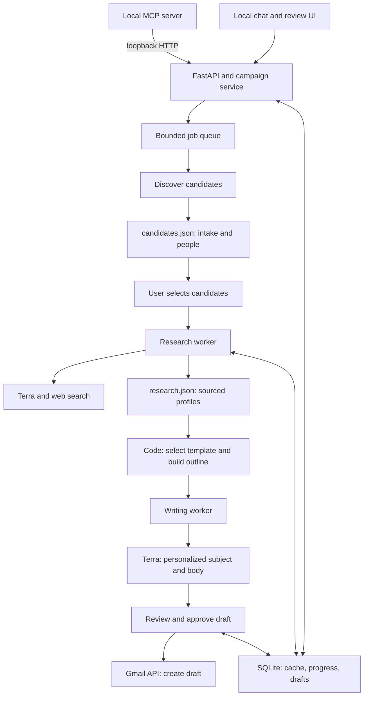
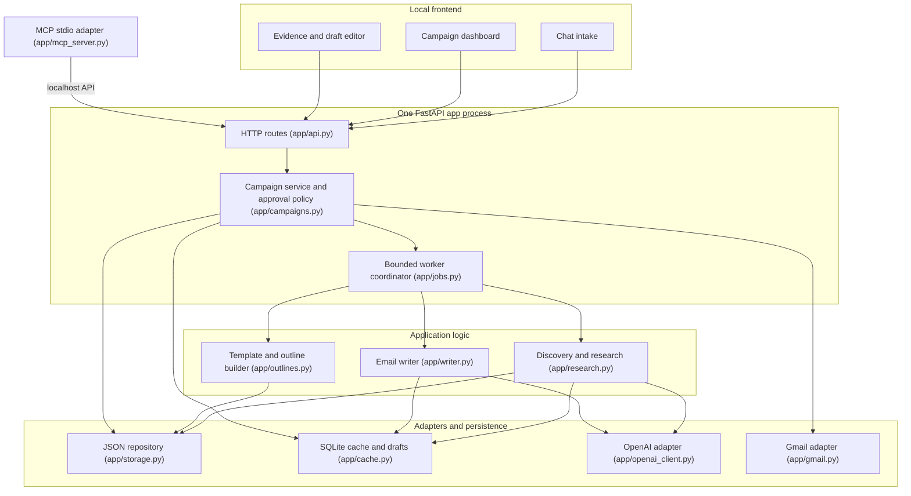

# Outreach Desk

Local research and outreach assistant: find professors, startup people, and club speakers/mentors; research
them from public sources; draft personalized emails; put approved ones into Gmail **Drafts**. It never sends mail.

One Python process (FastAPI + asyncio workers + SQLite), plain HTML/CSS/JS UI, optional stdio MCP adapter.

## Run

```bash
python3 -m venv .venv && .venv/bin/pip install -r requirements.txt
cp .env.example .env            # leave OPENAI_API_KEY empty for demo mode
.venv/bin/python -m app.api     # prints http://127.0.0.1:8765/?t=<token>; open that exact link
.venv/bin/python -m pytest -q   # tests
```

**Demo mode** (no `OPENAI_API_KEY`): discovery/research/writing use fictional fixture people labeled "(demo)", with
pages served locally at `/demo/pages/...` so source links open. One person per list has an unreachable page and one
has no public email, to show failure isolation and the missing-email state. The header badge says DEMO DATA.

**Live mode**: set `OPENAI_API_KEY` (and optionally `OPENAI_MODEL`, default `gpt-5.6-terra`). Discovery and research
use the Responses API with the `web_search` tool plus structured outputs; pages are fetched directly with a size cap.

## Connect Gmail (optional)

1. Google Cloud console: create a project, enable the **Gmail API**.
2. OAuth consent screen: External, add yourself as a test user. Scope: `https://www.googleapis.com/auth/gmail.compose` only.
3. Credentials: create an **OAuth client ID** of type **Desktop app**, download the JSON to
   `~/.config/outreach/credentials.json` (outside the repo; path configurable via `GMAIL_CREDENTIALS`).
4. `.venv/bin/python -m app.gmail` once; a browser window completes consent and saves `~/.config/outreach/token.json` (0600).
5. Restart the app. Without Gmail, approved drafts can still be previewed and exported as text.

`gmail.compose` creates/reads drafts; no inbox read scope is requested. Each Gmail draft carries an `X-Outreach-Key`
header; if a create call times out, the retry first scans recent drafts for that key instead of creating a duplicate.

## MCP

With the app running, register the stdio adapter, e.g. in Claude Code:

```bash
claude mcp add outreach-desk -- /path/to/.venv/bin/python -m app.mcp_server
```

Tools: `create_campaign`, `find_candidates`, `research_candidates`, `generate_drafts`, `list_campaign`,
`create_gmail_drafts`. The adapter only calls the loopback API (token from `~/.config/outreach/app_token`), so the
same approval rules apply: Gmail drafts are only created for drafts a human approved in the UI.

## Where data lives

- `candidates.json`, `research.json` at the repo root are **unfilled templates**; never modified.
- Each campaign gets `data/<campaign_id>/candidates.json` (intake + lightweight candidates) and
  `data/<campaign_id>/research.json` (sourced profiles keyed by `candidate_id`). `campaign_id` is generated and
  validated; paths always resolve under `data/`.
- `data/cache.sqlite3`: page cache (7 days, failures 1 hour), research cache (14 days), drafts keyed by
  `(campaign_id, candidate_id, template_version)`, jobs, usage counters, activity log. Not a substitute for the JSON files.
- Secrets: `.env` (git-ignored) and `~/.config/outreach/`. Nothing secret goes in campaign files or the browser.

JSON updates are a bounded read-modify-write under a per-campaign lock, written to a temp file, fsynced, then
`os.replace`d. That is O(n) I/O and memory per write, fine for 20-100 people. Past that, migrate to JSONL/SQLite with a
`schema_version` bump.

## Pipeline

intake → discovery → candidate review → research → evidence review → outline → draft → human review → Gmail Drafts.

- **Intake**: request text is parsed deterministically into editable fields; nothing is searched until you confirm.
- **Research**: every evidence claim must point at a URL the model cited or the app fetched; others are dropped.
  An email is `email_verified_on_page` only if the literal address appears on the fetched contact page. Missing emails
  are shown as missing, never guessed.
- **Outline**: plain code picks `research_professor`, `startup`, `speaker_invite`, or `rsvp_followup` from the intake
  (see `app/outlines.py` to edit). An RSVP follow-up is blocked unless you marked the invitation as sent.
- **Draft**: the writer gets only the outline, selected facts, recipient, and tone. Rule checks flag raw URLs, unknown
  dates/years/emails, implied prior relationships, superlative praise, placeholders, and over-length drafts.
- **Approval**: editing returns a draft to review. Changing evidence, template, ask, or background invalidates approval.

## Costs and limits to watch

- Per campaign: 1 discovery call + 1 research call per researched person + 1 writer call per draft. The intake screen
  shows the projection; the budget (default 60) is enforced and shown live. Cache hits are counted separately.
- Web search tool calls are billed per call on top of tokens; check current OpenAI pricing for your model.
- Concurrency: 2 research tasks, 1 writer, queues of 16. At most 2 pages fetched per person, 800 KB cap, 6 KB text kept.

## Stop, restart, resume

**Stop** halts queued work for a campaign; finished profiles are already on disk. If the process dies, on restart
running jobs become `interrupted` and "researching" candidates go back to `selected`. **Resume** re-queues only
unfinished work: people with a fresh profile and drafts with unchanged inputs are skipped, and Gmail drafts are never
recreated.

## Architecture





Security: API bound to 127.0.0.1, Host header checked, every `/api` route requires the token from the startup link.
Web page text is treated as untrusted data and all UI rendering escapes it.
