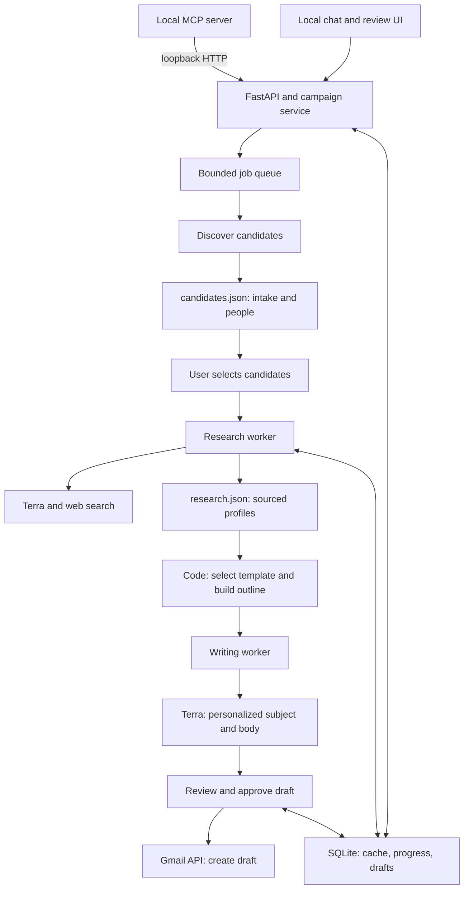
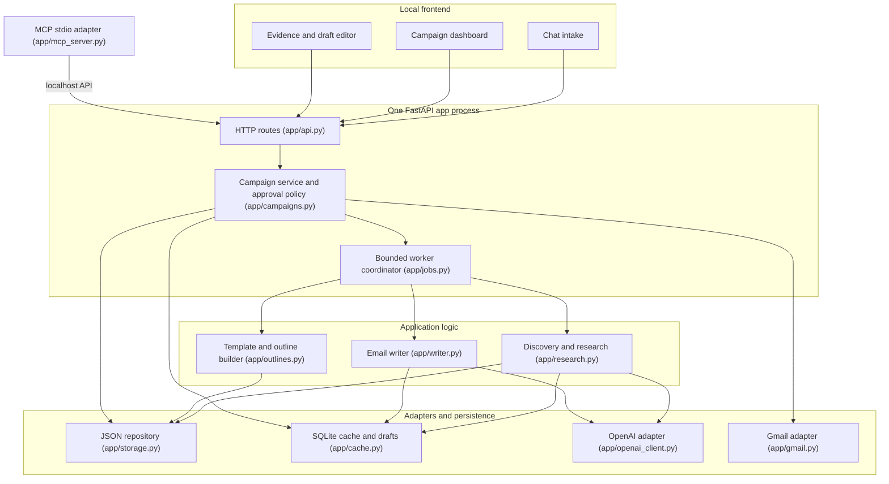

# HERMES

**HERMES — Human-reviewed Email Research, Messaging, and Engagement System** — is Nitu's personal command center
for research, outreach, and eventually much broader email automation. It finds professors, startup people, speakers,
and mentors; researches them from public sources; drafts genuinely personalized messages; and puts approved messages
into Gmail **Drafts**. The current MVP never sends mail.

## Why HERMES?

In Greek mythology, Hermes is the messenger who moves quickly between worlds. This project borrows that idea for a
modern workflow: carry an intent from a rough request, through discovery and evidence, into a clear message ready for
the right person's inbox. HERMES is meant to become more than a one-off email generator. The long-term vision is a
large personal email-automation system that can manage research, contacts, campaigns, follow-ups, and outcomes while
keeping consequential actions visible and under human control.

The design principle is **high-volume capability without low-quality outreach**. HERMES automates repetitive research,
organization, personalization, and drafting, but requires review before an email enters Gmail.

One Python process (FastAPI + asyncio workers + SQLite), plain HTML/CSS/JS UI, optional stdio MCP adapter.

## Run

```bash
python3 -m venv .venv && .venv/bin/pip install -r requirements.txt
cp .env.example .env            # leave OPENAI_API_KEY empty for demo mode
.venv/bin/python -m app.api     # prints http://127.0.0.1:8765/?t=<token>; open that exact link
.venv/bin/python -m pytest -q   # tests
```

**Demo mode** (no `OPENAI_API_KEY`): discovery/research/writing use fictional fixture people labeled "(demo)", with
pages served locally at `/demo/pages/...` so source links open. One person per list has an unreachable page and one
has no public email, to show failure isolation and the missing-email state. The header badge says DEMO DATA.

**Live mode**: set `OPENAI_API_KEY` (and optionally `OPENAI_MODEL`, default `gpt-5.6-terra`). Discovery and research
use the Responses API with the `web_search` tool plus structured outputs; pages are fetched directly with a size cap.

## Connect Gmail (optional)

1. Google Cloud console: create a project, enable the **Gmail API**.
2. OAuth consent screen: External, add yourself as a test user. Scope: `https://www.googleapis.com/auth/gmail.compose` only.
3. Credentials: create an **OAuth client ID** of type **Desktop app**, download the JSON to
   `~/.config/outreach/credentials.json` (outside the repo; path configurable via `GMAIL_CREDENTIALS`).
4. `.venv/bin/python -m app.gmail` once; a browser window completes consent and saves `~/.config/outreach/token.json` (0600).
5. Restart the app. Without Gmail, approved drafts can still be previewed and exported as text.

`gmail.compose` creates/reads drafts; no inbox read scope is requested. Each Gmail draft carries an `X-Outreach-Key`
header; if a create call times out, the retry first scans recent drafts for that key instead of creating a duplicate.

## MCP

With the app running, register the stdio adapter, e.g. in Claude Code:

```bash
claude mcp add hermes -- /path/to/.venv/bin/python -m app.mcp_server
```

Discovery tools: `parse_intake`, `create_campaign`, `find_candidates`, `research_candidates`, `configure_ranking`,
`adjust_candidate_score`, `correct_candidate`, `compare_candidates`, and `list_campaign`; drafting tools include
`generate_drafts` and `create_gmail_drafts`. Messaging-workspace tools include `list_message_templates`,
`save_message_template`, `add_reusable_content`, `configure_campaign_assets`, `create_campaign_rule`,
`run_campaign_rule`, `upload_attachment`, `list_reusable_assets`, and `messaging_policies` (plus template history,
duplication, and archive tools). The adapter only calls the loopback API (token from
`~/.config/outreach/app_token`), so the
same approval rules apply: Gmail drafts are only created for drafts a human approved in the UI.

## Where data lives

- `candidates.json`, `research.json` at the repo root are **unfilled templates**; never modified.
- Each campaign gets `data/<campaign_id>/candidates.json` (intake + lightweight candidates) and
  `data/<campaign_id>/research.json` (sourced profiles keyed by `candidate_id`). `campaign_id` is generated and
  validated; paths always resolve under `data/`.
- `data/cache.sqlite3`: page/research caches plus durable template versions, reusable content, sender identities,
  attachment metadata, campaign rules and their per-candidate action audit, contact policy, drafts, jobs, usage
  (plus a timestamped `usage_log`), analytics `milestones`, and `notifications` with read/dismiss state.
- `data/attachments/`: attachment bytes under generated filenames. The original display name, media type, size, and
  SHA-256 are stored in SQLite. `data/` is Git-ignored; set `DATA_ROOT=/an/absolute/local/path` to put all runtime data
  elsewhere. Never add that directory to version control.
- Secrets: `.env` (git-ignored) and `~/.config/outreach/`. Nothing secret goes in campaign files or the browser.

JSON updates are a bounded read-modify-write under a per-campaign lock, written to a temp file, fsynced, then
`os.replace`d. That is O(n) I/O and memory per write, fine for 20-100 people. Past that, migrate to JSONL/SQLite with a
`schema_version` bump.

## Pipeline

intake → discovery → candidate review → research → evidence review → outline → draft → human review → Gmail Drafts.

- **Intake**: live mode uses structured model extraction for complex requests, followed by deterministic schema and URL
  validation. Demo mode and provider failures use the deterministic parser. The UI displays every extracted field and
  at most one material clarification before confirmation; discovery does not start until confirmation.
- **Ranking**: candidates receive an auditable 0–100 score across topic, organization, role, geography, contact,
  evidence, and prior-contact state. Weights are editable. Every criterion shows its points and reason; absent or unknown
  data always contributes zero. Pinning and manual adjustments are explicitly labeled and do not become evidence.
- **Research**: every evidence claim must point at a URL the model cited or the app fetched; fetched claims also pass a
  deterministic grounding check. Others are dropped.
  An email is `email_verified_on_page` only if the literal address appears on the fetched contact page. Missing emails
  are shown as missing, never guessed.
- **Sources**: HERMES accepts bounded HTML/text pages and PDFs from profiles, directories, publication/conference pages,
  company/faculty pages, and up to ten user-supplied HTTP(S) URLs. PDF evidence retains a page locator when possible.
  Embedded prompt-like commands are stripped before model input; all remaining source content is still marked untrusted.
- **Corrections**: identity, affiliation, role/URL, email, fit, and evidence corrections record both values and their
  campaign provenance in SQLite, then reapply to matching people in future campaigns. Corrected emails are unverified,
  and corrected evidence is labeled `manual_correction` with `web_verified: false`.
- **Comparison**: select two to five people for a side-by-side view of scores, source freshness, official versus
  third-party evidence, missing fields, and confidence limitations.
- **Templates**: the SQLite-backed library ships with professor outreach, startup outreach, speaker invitation,
  mentorship request, RSVP follow-up, and general follow-up starters. Editing creates a new immutable version; old
  versions remain available for generation and audit. Preview and generation reject unknown, malformed, or unresolved
  `{{variables}}`. Templates can be created, edited, duplicated, archived, previewed, and inspected in the UI.
- **Reusable content**: sender identities can own signatures, event/club descriptions, personal introductions, calls
  to action, and supporting links. Campaign selection is captured in the draft input fingerprint.
- **Attachments**: resumes, club decks, event briefs, and one-pagers accept PDF, DOC/DOCX, or PPT/PPTX up to 10 MB.
  Filenames are validated against traversal/control characters, stored under generated names, and checked against the
  recorded size and SHA-256 before Gmail MIME construction. Final approval shows the exact display-name list.
- **Campaign rules**: saved rules can draft verified contacts, research the next N candidates, exclude prior contacts,
  prepare unanswered follow-ups, or assert mandatory manual review. Every apply requires a recorded dry-run first and
  stores the rule, candidate, action, status, and reason. Rules only queue research/drafting or update exclusions; they
  never approve a draft or perform an external action.
- **Draft**: the writer gets only the outline, selected facts, recipient, and tone. Rule checks flag raw URLs, unknown
  dates/years/emails, implied prior relationships, superlative praise, placeholders, and over-length drafts.
- **Approval**: editing returns a draft to review. Changing evidence, template, ask, background, reusable content, or
  attachments invalidates approval. Durable do-not-contact decisions block generation, approval, Gmail creation, and
  bulk rules. Human review and do-not-contact enforcement cannot be disabled through rule configuration.

## Costs and limits to watch

- Per campaign: 1 discovery call + 1 research call per researched person + 1 writer call per draft. Model-assisted
  intake happens before campaign creation and never triggers web search. The intake screen
  shows the projection; the budget (default 60) is enforced and shown live. Cache hits are counted separately.
- Web search tool calls are billed per call on top of tokens; check current OpenAI pricing for your model.
- Concurrency: 2 research tasks, 1 writer, queues of 16. At most 2 documents are fetched per person. HTML/text responses
  are capped at 800 KB; PDFs at 5 MB and 12 pages; extracted text at 6,000 characters; each request times out after
  12 seconds. Usage reports API calls, tokens, cache hits, documents fetched, bytes downloaded, and URLs skipped by the
  per-person cap. Limits are enforced before content reaches the model.

## Analytics and notifications

Open **Analytics** in the header. No tracking pixels, no hidden open tracking, no inbox reading: anything that happens
after you send is recorded by you (detail panel → Timeline → Replied / Interested / Declined / Bounced / Meeting
booked; press again to undo), or through `POST /api/campaigns/{cid}/candidates/{cand}/outcomes {"outcome": ..., "at"?}`.
An outcome needs a recorded send first ("I sent this message/invitation").

- **Funnel**: discovered → researched → verified contact → drafted → approved → scheduled → sent → replied →
  interested / declined / bounced / meeting booked. A count is the number of contacts that *ever* reached the stage
  inside the date range, so later edits don't erase history (an approved draft that is edited still counts as approved).
  Click a stage to list its contacts; every row links to the campaign and contact.
- **Rates**: verified contact (verified / researched), research failure (ever failed / attempted), approval
  (approved / drafted), reply (replied / sent), positive response (interested or meeting / replied), and median/mean
  time to reply (reply time − send time).
- **Usage**: API calls, tokens, cache hits, processing time (job start → finish), estimated cost.
- **Breakdowns** by campaign, campaign type, sender identity, template version, or organization; filter by campaign
  and date range (local dates, both inclusive). **Failures** (failed jobs, failed research, blocked drafts) and
  **Recent activity** use the same filters.
- **CSV**: "Export aggregate CSV" (one row per breakdown group) and "Export contacts CSV" (one row per contact with a
  timestamp per stage), or `GET /api/analytics/export?kind=aggregate|rows&campaign_id=&start=&end=&group_by=`.
  JSON: `GET /api/analytics` with the same filters.

**Unknown vs zero.** Unknown is `null` in JSON, an empty CSV cell, and *unknown* in the UI; 0 means none recorded.
Unknown cases: "scheduled" (HERMES has no scheduled sending), a rate with an empty denominator, cost unless
`HERMES_PRICE_INPUT_PER_MTOK` and `HERMES_PRICE_OUTPUT_PER_MTOK` (USD per million tokens) are set (web-search call fees
are not included), usage split by organization/template/sender (usage is only known per campaign), a sender identity
unless the campaign's reusable content/attachments all belong to one identity, and usage recorded before analytics
existed when a date filter is on (it has no timestamp).

**How counts stay honest.** Counts are computed from stored records, not from event counters. The `milestones` table
keeps one row per (campaign, contact, stage) with the first time it was reached, so re-running research, regenerating
unchanged drafts, marking something sent twice, or restarting never double-counts. On startup, campaigns created
before this feature are backfilled from their files; those times are best available (campaign creation for discovery,
`researched_at`, the draft's last update for approval).

**Notifications** (header bell, polled every 10 s): research batch finished, job failed, drafts need review, reply
recorded, follow-up due (a sent message with no recorded response after `HERMES_FOLLOWUP_DAYS`, default 7), Gmail draft
creation failed, and Gmail OAuth needs attention (a saved token stopped working). Each notification has a dedupe key;
batch summaries are keyed by the content of the result, so repeating the same work doesn't notify again. Read,
dismiss, and "mark all read" are stored in SQLite and survive restarts. API: `GET /api/notifications[?include_dismissed=true]`,
`POST /api/notifications/{id}/read|dismiss`, `POST /api/notifications/read-all`.

Optional desktop notifications: set `HERMES_DESKTOP_NOTIFICATIONS=1` (macOS `osascript`, or `notify-send` on Linux;
otherwise skipped). There is no email notification adapter: HERMES only holds the `gmail.compose` scope and never
sends mail, so an email channel would need its own credentials and a separate decision.

## Stop, restart, resume

**Stop** halts queued work for a campaign; finished profiles are already on disk. If the process dies, on restart
running jobs become `interrupted` and "researching" candidates go back to `selected`. **Resume** re-queues only
unfinished work: people with a fresh profile and drafts with unchanged inputs are skipped, and Gmail drafts are never
recreated.

## What is still missing

HERMES currently completes one safe local workflow: create a campaign, discover and research people, draft messages,
review them, and create Gmail drafts. It is not yet the complete email-automation system described by the long-term
vision. The main missing capabilities are:

### Contact and campaign management

- Rich contact merging, notes/tags, and relationship management beyond the current policy/contact record.
- Campaign search, rename, archive, duplicate, and delete controls.
- CSV import/export and a way to merge hand-curated contacts with discovered candidates.

### Follow-ups and inbox awareness

- Scheduled multi-step follow-up sequences. Current RSVP and general follow-ups require a human-recorded prior send;
  no-reply rules prepare drafts but do not infer sends or replies.
- Scheduled reminders, quiet hours, rate limits, and a review queue for follow-ups that are due.
- Gmail thread and reply synchronization so a sequence can stop when someone responds. This requires additional OAuth
  scope and a deliberate privacy review; the current `gmail.compose` scope does not read the inbox.
- Automatic outcome detection. Outcomes are recorded by hand today (see Analytics and notifications).

### Deeper automation

- Optional, explicitly approved sending or scheduled sending. HERMES currently creates drafts only.
- Calendar integration for proposing times, creating events, and attaching event details after a recipient agrees.
- Scheduled/rate-limited rule execution and richer multi-step sequences. Current bulk rules are deliberately explicit:
  save, dry-run, then apply, with every resulting draft still requiring individual human approval.

### Better discovery and research

- Saved filter presets and richer source-specific adapters (the current bounded fetcher handles their HTML/PDF pages).
- Semantic grounding beyond the current conservative lexical check, while preserving deterministic rejection of
  unsupported claims.

### Analytics and operations

- Email/push notification channels and scheduled-send failure alerts (no scheduler exists yet).
- Dependency locking, automated CI, browser-level UI coverage, migration tooling, structured operational logs, backup,
  and restore procedures.
- Multi-user authentication and remote deployment. The current security model is intentionally single-user and local.

The next highest-value milestone is **contact memory + reply-aware follow-ups**. Together, those turn HERMES from a
campaign drafting tool into a system that can manage ongoing relationships without repeatedly researching or messaging
the same person.

## Architecture





Security: API bound to 127.0.0.1, Host header checked, every `/api` route requires the token from the startup link.
Web page text is treated as untrusted data and all UI rendering escapes it.
